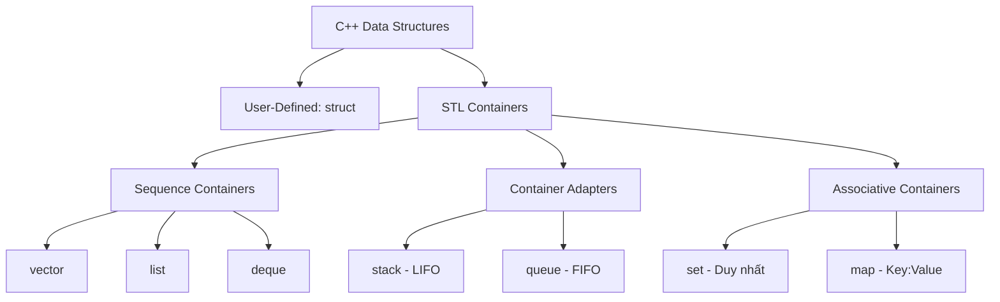

# 🚀 Cấu Trúc Dữ Liệu Trong C++ (C++ Data Structures CheatSheet)
> *Tài liệu chi tiết, trực quan, dễ hiểu bám sát lộ trình C++ Data Structures từ W3Schools*

[](https://isocpp.org/)
[](https://www.w3schools.com/cpp/cpp_data_structures.asp)
[](#)

---

## 📑 Mục lục

1. [Tổng quan về Cấu trúc dữ liệu trong C++](#1-tổng-quan-về-cấu-trúc-dữ-liệu-trong-c)
2. [Phần I: Struct - Cấu trúc dữ liệu tự định nghĩa](#phần-i-struct---cấu-trúc-dữ-liệu-tự-định-nghĩa)
   - [2.1. Struct cơ bản (Structures)](#21-struct-cơ-bản-structures)
   - [2.2. Khai báo nhiều biến với một Struct](#22-khai-báo-nhiều-biến-với-một-struct)
   - [2.3. Struct có tên (Named Structures)](#23-struct-có-tên-named-structures)
   - [2.4. Khởi tạo giá trị cho Struct](#24-khởi-tạo-giá-trị-cho-struct)
   - [2.5. Struct lồng nhau (Nested Structures)](#25-struct-lồng-nhau-nested-structures)
   - [2.6. Truyền Struct vào Hàm (Tham trị & Tham chiếu)](#26-truyền-struct-vào-hàm-tham-trị--tham-chiếu)
3. [Phần II: STL Containers - Cấu trúc dữ liệu thư viện chuẩn](#phần-ii-stl-containers---cấu-trúc-dữ-liệu-thư-viện-chuẩn)
   - [3.1. Vector (`std::vector` - Mảng động)](#31-vector-stdvector---mảng-động)
   - [3.2. List (`std::list` - Danh sách liên kết đôi)](#32-list-stdlist---danh-sách-liên-kết-đôi)
   - [3.3. Stack (`std::stack` - Ngăn xếp LIFO)](#33-stack-stdstack---ngăn-xếp-lifo)
   - [3.4. Queue (`std::queue` - Hàng đợi FIFO)](#34-queue-stdqueue---hàng-đợi-fifo)
   - [3.5. Deque (`std::deque` - Hàng đợi hai đầu)](#35-deque-stddeque---hàng-đợi-hai-đầu)
   - [3.6. Set (`std::set` - Tập hợp không trùng lặp)](#36-set-stdset---tập-hợp-không-trùng-lặp)
   - [3.7. Map (`std::map` - Cặp Khóa - Giá trị)](#37-map-stdmap---cặp-khóa---giá-trị)
   - [3.8. Bộ lặp Iterators](#38-bộ-lặp-iterators)
4. [Phần III: Bảng so sánh & Sơ đồ lựa chọn cấu trúc dữ liệu](#phần-iii-bảng-so-sánh--sơ-đồ-lựa-chọn-cấu-trúc-dữ-liệu)
   - [4.1. Bảng so sánh độ phức tạp (Big-O CheatSheet)](#41-bảng-so-sánh-độ-phức-tạp-big-o-cheatsheet)
   - [4.2. Khi nào nên dùng cấu trúc nào?](#42-khi-nào-nên-dùng-cấu-trúc-nào)

---

## 1. Tổng quan về Cấu trúc dữ liệu trong C++

Trong C++, cấu trúc dữ liệu được chia làm hai nhóm chính theo chương trình học W3Schools:
1. **Structures (`struct`)**: Cho phép nhóm nhiều biến có kiểu dữ liệu khác nhau vào cùng một tên đại diện (User-defined Data Type).
2. **Standard Containers (STL)**: Các cấu trúc dữ liệu có sẵn tối ưu hóa cao trong Standard Template Library (`vector`, `list`, `stack`, `queue`, `deque`, `set`, `map`).



---

## PHẦN I: Struct - Cấu trúc dữ liệu tự định nghĩa

### 2.1. Struct cơ bản (Structures)

Cấu trúc (`struct`) là cách bạn gom các biến có kiểu dữ liệu khác nhau lại thành một kiểu dữ liệu mới do bạn tự tạo ra. Mỗi biến bên trong được gọi là một **thành viên (member)**.

#### 📌 Cú pháp khai báo trực tiếp với biến:
```cpp
struct {
    kieu_du_lieu ten_thanh_vien_1;
    kieu_du_lieu ten_thanh_vien_2;
    // ...
} ten_bien_struct;
```

#### 💡 Cách truy cập thành viên:
Sử dụng toán tử dấu chấm `.` (Dot operator):
```cpp
ten_bien_struct.ten_thanh_vien = gia_tri;
```

#### 💻 Ví dụ hoàn chỉnh:
```cpp
#include <iostream>
#include <string>
using namespace std;

int main() {
    // 1. Khai báo struct và tạo ngay biến myStructure
    struct {
        int myNum;
        string myString;
    } myStructure;

    // 2. Gán giá trị cho các thành viên thông qua dấu chấm (.)
    myStructure.myNum = 1;
    myStructure.myString = "Xin chao W3Schools C++!";

    // 3. In các giá trị ra màn hình
    cout << "So: " << myStructure.myNum << endl;
    cout << "Chuoi: " << myStructure.myString << endl;

    return 0;
}
```
**Output:**
```text
So: 1
Chuoi: Xin chao W3Schools C++!
```

---

### 2.2. Khai báo nhiều biến với một Struct

Bạn có thể tạo ra nhiều biến độc lập cùng chia sẻ cấu trúc này bằng cách đặt các tên biến cách nhau bởi dấu phẩy `,` trước dấu chấm phẩy `;`.

#### 📌 Cú pháp:
```cpp
struct {
    kieu_du_lieu thanh_vien_1;
    kieu_du_lieu thanh_vien_2;
} bien_A, bien_B, bien_C;
```

#### 💻 Ví dụ hoàn chỉnh:
```cpp
#include <iostream>
#include <string>
using namespace std;

int main() {
    // Tạo 3 biến myCar1, myCar2, myCar3 có cùng cấu trúc
    struct {
        string brand;
        string model;
        int year;
    } myCar1, myCar2;

    // Gán thông tin xe 1
    myCar1.brand = "BMW";
    myCar1.model = "X5";
    myCar1.year = 1999;

    // Gán thông tin xe 2
    myCar2.brand = "Ford";
    myCar2.model = "Mustang";
    myCar2.year = 1969;

    // In thông tin
    cout << myCar1.brand << " " << myCar1.model << " (" << myCar1.year << ")\n";
    cout << myCar2.brand << " " << myCar2.model << " (" << myCar2.year << ")\n";

    return 0;
}
```
**Output:**
```text
BMW X5 (1999)
Ford Mustang (1969)
```

---

### 2.3. Struct có tên (Named Structures)

Đặt tên cho struct là cách **chuẩn mực và được khuyến khích nhất** vì nó biến struct thành một kiểu dữ liệu độc lập, có thể tái sử dụng ở bất kỳ đâu trong chương trình.

#### 📌 Cú pháp:
```cpp
// Định nghĩa kiểu struct có tên
struct TenKieuStruct {
    kieu_du_lieu thanh_vien_1;
    kieu_du_lieu thanh_vien_2;
};

// Khai báo biến bằng tên kiểu struct
TenKieuStruct ten_bien;
```

#### 💻 Ví dụ hoàn chỉnh:
```cpp
#include <iostream>
#include <string>
using namespace std;

// Đặt tên struct là 'Car' (quy ước viết hoa chữ cái đầu)
struct Car {
    string brand;
    string model;
    int year;
};

int main() {
    // Tạo biến dựa trên kiểu 'Car'
    Car car1;
    car1.brand = "Toyota";
    car1.model = "Camry";
    car1.year = 2022;

    Car car2;
    car2.brand = "Honda";
    car2.model = "Civic";
    car2.year = 2023;

    cout << "Xe 1: " << car1.brand << " " << car1.model << endl;
    cout << "Xe 2: " << car2.brand << " " << car2.model << endl;

    return 0;
}
```

---

### 2.4. Khởi tạo giá trị cho Struct

Thay vì gán từng dòng với toán tử `.`, C++ hỗ trợ khởi tạo nhanh giá trị cho Struct ngay khi tạo biến.

#### 📌 Cách 1: Khởi tạo danh sách (Initializer List / Uniform Initialization)
```cpp
#include <iostream>
#include <string>
using namespace std;

struct Student {
    string name;
    int age;
    double gpa;
};

int main() {
    // Khởi tạo theo thứ tự các thành viên khai báo trong struct
    Student s1 = {"Nguyen Van A", 20, 3.75};
    
    // C++11 Uniform Initialization (khuyên dùng, không cần dấu =)
    Student s2 {"Tran Thi B", 19, 3.90};

    cout << s1.name << " - " << s1.age << " tuoi - GPA: " << s1.gpa << endl;
    cout << s2.name << " - " << s2.age << " tuoi - GPA: " << s2.gpa << endl;

    return 0;
}
```

---

### 2.5. Struct lồng nhau (Nested Structures)

Một struct có thể chứa một struct khác làm thành viên của nó.

#### 💻 Ví dụ hoàn chỉnh:
```cpp
#include <iostream>
#include <string>
using namespace std;

// Struct Địa chỉ
struct Address {
    string street;
    string city;
};

// Struct Nhân viên chứa Struct Địa chỉ
struct Employee {
    string name;
    int id;
    Address address; // Struct lồng bên trong
};

int main() {
    Employee emp;
    emp.name = "Le Van C";
    emp.id = 1001;
    emp.address.street = "123 Nguyen Hue";
    emp.address.city = "TP. Ho Chi Minh";

    cout << "Nhan vien: " << emp.name << " (ID: " << emp.id << ")\n";
    cout << "Dia chi: " << emp.address.street << ", " << emp.address.city << endl;

    return 0;
}
```

---

### 2.6. Truyền Struct vào Hàm (Tham trị & Tham chiếu)

Khi làm việc với Struct, truyền theo **tham chiếu hằng (`const StructName&`)** là kỹ thuật phổ biến nhất để tránh việc sao chép tốn bộ nhớ.

```cpp
#include <iostream>
#include <string>
using namespace std;

struct Book {
    string title;
    string author;
    double price;
};

// 1. Truyền tham chiếu hằng: Tối ưu bộ nhớ + Không thể chỉnh sửa
void printBook(const Book& b) {
    cout << "Sach: " << b.title << " | Tac gia: " << b.author << " | Gia: $" << b.price << endl;
}

// 2. Truyền tham chiếu thông thường: Cho phép chỉnh sửa trực tiếp struct gốc
void applyDiscount(Book& b, double percent) {
    b.price -= b.price * (percent / 100.0);
}

int main() {
    Book myBook = {"Lap trinh C++", "W3Schools", 50.0};

    cout << "Truoc khi giam gia:\n";
    printBook(myBook);

    applyDiscount(myBook, 20.0); // Giam 20%

    cout << "Sau khi giam 20%:\n";
    printBook(myBook);

    return 0;
}
```
**Output:**
```text
Truoc khi giam gia:
Sach: Lap trinh C++ | Tac gia: W3Schools | Gia: $50
Sau khi giam 20%:
Sach: Lap trinh C++ | Tac gia: W3Schools | Gia: $40
```

---

## PHẦN II: STL Containers - Cấu trúc dữ liệu thư viện chuẩn

C++ cung cấp sẵn bộ thư viện STL (Standard Template Library) cực kỳ mạnh mẽ giúp quản lý và xử lý dữ liệu với hiệu năng cao.

---

### 3.1. Vector (`std::vector` - Mảng động)

`vector` là mảng có thể **tự động co giãn kích thước** khi thêm hoặc bớt phần tử. Các phần tử nằm kề nhau liên tục trong bộ nhớ RAM.

#### 📌 Thư viện & Cú pháp khai báo:
```cpp
#include <vector>

std::vector<kieu_du_lieu> ten_vector;
std::vector<kieu_du_lieu> ten_vector = {pt1, pt2, pt3};
std::vector<kieu_du_lieu> ten_vector(so_luong, gia_tri_mac_dinh);
```

#### 📋 Các hàm quan trọng của `vector`:
| Hàm | Ý nghĩa / Cách hoạt động | Ví dụ |
| :--- | :--- | :--- |
| `push_back(val)` | Thêm phần tử vào cuối vector | `v.push_back(10);` |
| `pop_back()` | Xóa phần tử cuối cùng | `v.pop_back();` |
| `size()` | Trả về số lượng phần tử hiện có | `int n = v.size();` |
| `empty()` | Kiểm tra rỗng (trả về `true`/`false`) | `if (v.empty()) ...` |
| `at(index)` hoặc `[index]` | Truy cập phần tử tại vị trí index | `cout << v.at(0);` |
| `front()` | Lấy phần tử đầu tiên | `cout << v.front();` |
| `back()` | Lấy phần tử cuối cùng | `cout << v.back();` |
| `clear()` | Xóa toàn bộ phần tử trong vector | `v.clear();` |

#### 💻 Ví dụ code hoàn chỉnh:
```cpp
#include <iostream>
#include <vector>
#include <string>
using namespace std;

int main() {
    // 1. Khoi tao vector chua cac chuoi
    vector<string> cars = {"Volvo", "BMW", "Ford", "Mazda"};

    // 2. Them phan tu vao cuoi
    cars.push_back("Tesla");

    // 3. Truy cap phan tu
    cout << "Phan tu dau tien: " << cars.front() << endl; // Volvo
    cout << "Phan tu cuoi cung: " << cars.back() << endl;  // Tesla
    cout << "Phan tu tai index 1: " << cars.at(1) << endl; // BMW

    // 4. Thay doi gia tri phan tu
    cars[0] = "Toyota";

    // 5. Xoa phan tu cuoi
    cars.pop_back(); // Xoa "Tesla"

    // 6. Kich thuoc hien tai
    cout << "So luong xe: " << cars.size() << endl;

    // 7. Duyet vector bang vong lap For-Each (Range-based for loop)
    cout << "Danh sach xe:\n";
    for (const string& car : cars) {
        cout << " - " << car << endl;
    }

    return 0;
}
```
**Output:**
```text
Phan tu dau tien: Volvo
Phan tu cuoi cung: Tesla
Phan tu tai index 1: BMW
So luong xe: 3
Danh sach xe:
 - Toyota
 - BMW
 - Ford
```

---

### 3.2. List (`std::list` - Danh sách liên kết đôi)

Khác với `vector`, `list` lưu trữ các phần tử phân tán rải rác trong bộ nhớ, liên kết với nhau bằng con trỏ (Doubly Linked List).
- **Ưu điểm**: Thao tác chèn/xóa ở đầu hoặc cuối cực nhanh ($O(1)$).
- **Nhược điểm**: Không hỗ trợ truy cập ngẫu nhiên qua chỉ số `list[i]` hoặc `list.at(i)`.

#### 📌 Thư viện & Cú pháp:
```cpp
#include <list>

std::list<kieu_du_lieu> ten_list;
```

#### 📋 Các hàm quan trọng của `list`:
| Hàm | Ý nghĩa |
| :--- | :--- |
| `push_front(val)` / `push_back(val)` | Thêm phần tử vào **đầu** / **cuối** list |
| `pop_front()` / `pop_back()` | Xóa phần tử ở **đầu** / **cuối** list |
| `front()` / `back()` | Lấy giá trị phần tử ở đầu / cuối |
| `size()` / `empty()` | Lấy số lượng phần tử / Kiểm tra rỗng |

#### 💻 Ví dụ code hoàn chỉnh:
```cpp
#include <iostream>
#include <list>
#include <string>
using namespace std;

int main() {
    list<string> animals = {"Dog", "Cat", "Cow"};

    // 1. Them vao dau va cuoi list
    animals.push_front("Elephant"); // Dau
    animals.push_back("Tiger");     // Cuoi

    cout << "Dau list: " << animals.front() << endl;
    cout << "Cuoi list: " << animals.back() << endl;

    // 2. Xoa phan tu dau va cuoi
    animals.pop_front(); // Xoa Elephant
    animals.pop_back();  // Xoa Tiger

    // 3. Duyet list
    cout << "Cac con vat trong list:\n";
    for (const string& a : animals) {
        cout << a << " ";
    }
    cout << endl;

    return 0;
}
```
**Output:**
```text
Dau list: Elephant
Cuoi list: Tiger
Cac con vat trong list:
Dog Cat Cow 
```

---

### 3.3. Stack (`std::stack` - Ngăn xếp LIFO)

Ngăn xếp hoạt động theo cơ chế **LIFO (Last In, First Out)** - Phần tử nào thêm vào sau cùng sẽ được lấy ra đầu tiên (giống như một chồng đĩa).

```text
    |      |
    |  30  |  <-- TOP (Vao sau cung -> Ra dau tien)
    |  20  |
    |  10  |
    +------+
```

#### 📌 Thư viện & Cú pháp:
```cpp
#include <stack>

std::stack<kieu_du_lieu> ten_stack;
```

#### 📋 Các hàm quan trọng của `stack`:
| Hàm | Ý nghĩa |
| :--- | :--- |
| `push(val)` | Đẩy một phần tử lên đỉnh stack |
| `pop()` | Xóa phần tử trên đỉnh stack (không trả về giá trị) |
| `top()` | Lấy giá trị phần tử đang ở đỉnh stack |
| `empty()` | Kiểm tra stack có rỗng không (`true` nếu rỗng) |
| `size()` | Trả về số lượng phần tử |

#### 💻 Ví dụ code hoàn chỉnh:
```cpp
#include <iostream>
#include <stack>
#include <string>
using namespace std;

int main() {
    stack<string> browserHistory;

    // 1. Nguoi dung mo cac trang web
    browserHistory.push("google.com");
    browserHistory.push("w3schools.com");
    browserHistory.push("github.com");

    cout << "Trang hien tai (dinh stack): " << browserHistory.top() << endl;

    // 2. Nhan nut 'Back' (lay ra trang gan nhat)
    browserHistory.pop();
    cout << "Sau khi nhan Back, trang hien tai la: " << browserHistory.top() << endl;

    // 3. Duyet va lam rong toan bo Stack
    cout << "\nThu tu quay lai cac trang:\n";
    while (!browserHistory.empty()) {
        cout << " -> " << browserHistory.top() << endl;
        browserHistory.pop(); // Phai pop de xem phan tu ke tiep
    }

    return 0;
}
```
**Output:**
```text
Trang hien tai (dinh stack): github.com
Sau khi nhan Back, trang hien tai la: w3schools.com

Thu tu quay lai cac trang:
 -> w3schools.com
 -> google.com
```

> ⚠️ **Lưu ý:** Lệnh `pop()` chỉ **xóa** phần tử khỏi stack chứ **không trả về giá trị**. Để lấy giá trị trước khi xóa, bạn bắt buộc phải gọi `top()`.

---

### 3.4. Queue (`std::queue` - Hàng đợi FIFO)

Hàng đợi hoạt động theo cơ chế **FIFO (First In, First Out)** - Phần tử nào vào trước sẽ được xử lý ra trước (giống như việc xếp hàng mua vé).

```text
Vao (Push/Back) --> [ 30 ] [ 20 ] [ 10 ] --> Ra (Pop/Front)
```

#### 📌 Thư viện & Cú pháp:
```cpp
#include <queue>

std::queue<kieu_du_lieu> ten_queue;
```

#### 📋 Các hàm quan trọng của `queue`:
| Hàm | Ý nghĩa |
| :--- | :--- |
| `push(val)` | Thêm phần tử vào cuối hàng đợi |
| `pop()` | Xóa phần tử ở đầu hàng đợi |
| `front()` | Xem phần tử ở đầu (phần tử sắp được phục vụ) |
| `back()` | Xem phần tử ở cuối hàng |
| `empty()` | Kiểm tra xem hàng đợi có rỗng không |
| `size()` | Số lượng phần tử đang chờ trong hàng |

#### 💻 Ví dụ code hoàn chỉnh:
```cpp
#include <iostream>
#include <queue>
#include <string>
using namespace std;

int main() {
    queue<string> ticketLine;

    // 1. Khach hang xep hang
    ticketLine.push("An");
    ticketLine.push("Binh");
    ticketLine.push("Cuong");

    cout << "Nguoi dung dau hang: " << ticketLine.front() << endl;
    cout << "Nguoi dung cuoi hang: " << ticketLine.back() << endl;
    cout << "So nguoi dang cho: " << ticketLine.size() << endl;

    // 2. Phuc vu tung nguoi theo thu tu FIFO
    cout << "\nBat dau phuc vu:\n";
    while (!ticketLine.empty()) {
        cout << "Dang phuc vu: " << ticketLine.front() << endl;
        ticketLine.pop(); // Xoa nguoi da phuc vu xong
    }

    return 0;
}
```
**Output:**
```text
Nguoi dung dau hang: An
Nguoi dung cuoi hang: Cuong
So nguoi dang cho: 3

Bat dau phuc vu:
Dang phuc vu: An
Dang phuc vu: Binh
Dang phuc vu: Cuong
```

---

### 3.5. Deque (`std::deque` - Double-Ended Queue)

`deque` (phát âm là "deck") là hàng đợi 2 đầu. Nó kết hợp thế mạnh của cả `vector` và `list`:
- Cho phép thêm/xóa ở **cả đầu và cuối** với tốc độ $O(1)$.
- Cho phép truy cập ngẫu nhiên qua chỉ số như mảng: `d[i]` hoặc `d.at(i)`.

#### 📌 Thư viện & Cú pháp:
```cpp
#include <deque>

std::deque<kieu_du_lieu> ten_deque;
```

#### 📋 Các hàm quan trọng:
`push_front()`, `push_back()`, `pop_front()`, `pop_back()`, `front()`, `back()`, `at()`, `size()`, `empty()`.

#### 💻 Ví dụ code hoàn chỉnh:
```cpp
#include <iostream>
#include <deque>
#include <string>
using namespace std;

int main() {
    deque<string> cars = {"BMW", "Ford"};

    // 1. Them vao dau va cuoi
    cars.push_front("Mercedes"); // Them vao dau
    cars.push_back("Audi");      // Them vao cuoi

    // 2. Truy cap qua chi so (Indexing giong Vector)
    cout << "Xe tai vi tri 0: " << cars[0] << endl;     // Mercedes
    cout << "Xe tai vi tri 2: " << cars.at(2) << endl;  // Ford

    // 3. Xoa phan tu dau va cuoi
    cars.pop_front(); // Xoa Mercedes
    cars.pop_back();  // Xoa Audi

    // 4. In danh sach con lai
    cout << "\nCac xe con lai:\n";
    for (const string& car : cars) {
        cout << car << " ";
    }
    cout << endl;

    return 0;
}
```
**Output:**
```text
Xe tai vi tri 0: Mercedes
Xe tai vi tri 2: Ford

Cac xe con lai:
BMW Ford 
```

---

### 3.6. Set (`std::set` - Tập hợp không trùng lặp)

`set` là tập hợp các phần tử thỏa mãn 2 điều kiện cốt lõi:
1. **Duy nhất (Unique)**: Mọi phần tử trùng lặp đều tự động bị loại bỏ.
2. **Tự động sắp xếp (Sorted)**: Mặc định luôn tự sắp xếp tăng dần.

#### 📌 Thư viện & Cú pháp:
```cpp
#include <set>

std::set<kieu_du_lieu> ten_set;
// Sap xep giam dan:
std::set<kieu_du_lieu, greater<kieu_du_lieu>> ten_set_giam_dan;
```

#### 📋 Các hàm quan trọng của `set`:
| Hàm | Ý nghĩa |
| :--- | :--- |
| `insert(val)` | Thêm phần tử vào set (tự động bỏ qua nếu đã tồn tại) |
| `erase(val)` | Xóa phần tử có giá trị `val` |
| `count(val)` | Kiểm tra tồn tại: Trả về `1` nếu có, `0` nếu không có |
| `find(val)` | Tìm kiếm phần tử (trả về iterator đến vị trí đó) |
| `size()` / `empty()` | Lấy số lượng phần tử / Kiểm tra rỗng |

#### 💻 Ví dụ code hoàn chỉnh:
```cpp
#include <iostream>
#include <set>
using namespace std;

int main() {
    // 1. Khoi tao set
    set<int> numbers = {5, 2, 8, 1, 5, 2}; // Co trung lap 5 va 2

    // 2. Chen phan tu
    numbers.insert(10);
    numbers.insert(2); // Bi bo qua vi da co so 2

    // 3. In cac phan tu: Tu dong loc trung lap & Sap xep tang dan
    cout << "Cac phan tu trong set (da sap xep tang dan va loc trung):\n";
    for (int x : numbers) {
        cout << x << " "; // In ra: 1 2 5 8 10
    }
    cout << endl;

    // 4. Kiem tra xem mot phan tu co ton tai khong bang .count()
    int can_tim = 8;
    if (numbers.count(can_tim)) {
        cout << "Gia tri " << can_tim << " CO trong set." << endl;
    } else {
        cout << "Gia tri " << can_tim << " KHONG co trong set." << endl;
    }

    // 5. Xoa phan tu
    numbers.erase(1); // Xoa so 1
    cout << "So luong phan tu sau khi xoa: " << numbers.size() << endl;

    return 0;
}
```
**Output:**
```text
Cac phan tu trong set (da sap xep tang dan va loc trung):
1 2 5 8 10 
Gia tri 8 CO trong set.
So luong phan tu sau khi xoa: 4
```

---

### 3.7. Map (`std::map` - Cặp Khóa - Giá trị)

`map` lưu trữ các phần tử dưới dạng cặp **Key - Value (Khóa - Giá trị)**:
- Mỗi **Key là duy nhất** và được dùng để truy xuất Giá trị tương ứng.
- Map tự động sắp xếp các phần tử theo thứ tự **tăng dần của Key**.

#### 📌 Thư viện & Cú pháp:
```cpp
#include <map>

std::map<kieu_key, kieu_value> ten_map;
```

#### 📋 Các hàm quan trọng của `map`:
| Thao tác / Hàm | Cú pháp | Ý nghĩa |
| :--- | :--- | :--- |
| Gán hoặc thêm | `m[key] = value;` | Thêm hoặc cập nhật giá trị cho key |
| Chèn cặp | `m.insert({key, val});` | Chèn nếu key chưa tồn tại |
| Truy cập | `m[key]` hoặc `m.at(key)` | Lấy giá trị của key |
| Kiểm tra key | `m.count(key)` | Trả về `1` nếu có key, `0` nếu không |
| Xóa theo key | `m.erase(key)` | Xóa cả cặp key-value |

#### 💻 Ví dụ code hoàn chỉnh:
```cpp
#include <iostream>
#include <map>
#include <string>
using namespace std;

int main() {
    // 1. Tao map luu ten hoc sinh (string) va diem so (int)
    map<string, int> studentAges;

    // 2. Them phan tu bang toan tu ngoac vuong []
    studentAges["Alice"] = 20;
    studentAges["Bob"] = 22;
    studentAges["Charlie"] = 19;

    // 3. Them phan tu bang ham insert
    studentAges.insert({"David", 21});

    // 4. Cap nhat gia tri
    studentAges["Alice"] = 21; // Cap nhat tuoi cua Alice thanh 21

    // 5. Truy cap gia tri cua mot key
    cout << "Tuoi cua Bob: " << studentAges["Bob"] << endl;

    // 6. Duyet toan bo map: Moi phan tu co .first la Key, .second la Value
    cout << "\nDanh sach sinh vien (tu dong sap xep theo ten A-Z):\n";
    for (const auto& pair : studentAges) {
        cout << "Ten: " << pair.first << " | Tuoi: " << pair.second << endl;
    }

    // 7. Kiem tra key co ton tai khong
    if (studentAges.count("Alice")) {
        cout << "\nTim thay Alice trong he thong." << endl;
    }

    return 0;
}
```
**Output:**
```text
Tuoi cua Bob: 22

Danh sach sinh vien (tu dong sap xep theo ten A-Z):
Ten: Alice | Tuoi: 21
Ten: Bob | Tuoi: 22
Ten: Charlie | Tuoi: 19
Ten: David | Tuoi: 21

Tim thay Alice trong he thong.
```

---

### 3.8. Bộ lặp Iterators

`Iterator` là một đối tượng đóng vai trò như một **con trỏ thông minh**, được dùng để duyệt qua các phần tử của các cấu trúc dữ liệu STL (đặc biệt hữu dụng với `set`, `map`, `list` vốn không có chỉ số `[i]`).

#### 📌 Các hàm iterator cơ bản:
- `begin()`: Trả về iterator trỏ vào **phần tử đầu tiên**.
- `end()`: Trả về iterator trỏ vào vị trí **ngay sau phần tử cuối cùng**.

#### 💻 Ví dụ code:
```cpp
#include <iostream>
#include <vector>
using namespace std;

int main() {
    vector<int> numbers = {10, 20, 30, 40};

    // 1. Duyet bang iterator truyen thong
    vector<int>::iterator it;
    cout << "Duyet bang iterator:\n";
    for (it = numbers.begin(); it != numbers.end(); ++it) {
        // Dung toan tu giai tham chieu (*) de lay gia tri
        cout << *it << " ";
    }
    cout << endl;

    // 2. Dung tu khoa 'auto' (C++11 tro len giup code ngan gon)
    cout << "Duyet bang auto iterator:\n";
    for (auto iter = numbers.begin(); iter != numbers.end(); ++iter) {
        cout << *iter << " ";
    }
    cout << endl;

    return 0;
}
```

---

## PHẦN III: Bảng so sánh & Sơ đồ lựa chọn cấu trúc dữ liệu

### 4.1. Bảng so sánh độ phức tạp (Big-O CheatSheet)

| Cấu trúc dữ liệu | Truy cập ngẫu nhiên `[i]` | Thêm/Xóa ở Đầu | Thêm/Xóa ở Cuối | Thêm/Xóa ở Giữa | Sắp xếp sẵn? | Chứa phần tử trùng? |
| :--- | :---: | :---: | :---: | :---: | :---: | :---: |
| **`vector`** | $O(1)$ | $O(N)$ | $O(1)$ | $O(N)$ | ❌ Không |  Có |
| **`list`** | $O(N)$ | $O(1)$ | $O(1)$ | $O(1)$ *(khi có iterator)* | ❌ Không |  Có |
| **`deque`** | $O(1)$ | $O(1)$ | $O(1)$ | $O(N)$ | ❌ Không |  Có |
| **`stack`** | ❌ Không | ❌ | $O(1)$ *(chỉ thao tác đỉnh)* | ❌ | ❌ Không |  Có |
| **`queue`** | ❌ Không | $O(1)$ *(lấy đầu)* | $O(1)$ *(thêm cuối)* | ❌ | ❌ Không |  Có |
| **`set`** | ❌ Không | $O(\log N)$ | $O(\log N)$ | $O(\log N)$ |  **Tự động** | ❌ **Không** |
| **`map`** | $O(\log N)$ *(qua key)* | $O(\log N)$ | $O(\log N)$ | $O(\log N)$ |  **Theo Key** | Key: ❌, Val:  |

---

### 4.2. Khi nào nên dùng cấu trúc nào?

Hãy tự đặt các câu hỏi sau để chọn cấu trúc chuẩn nhất:

```text
❓ 1. Bạn có cần lưu trữ dữ liệu theo cặp (Key -> Value) không?
   └── Có: Dùng std::map (hoặc std::unordered_map nếu cần tốc độ O(1))
   └── Không: Đi tiếp câu 2.

❓ 2. Bạn có cần các phần tử duy nhất (không trùng lặp) và tự sắp xếp không?
   └── Có: Dùng std::set
   └── Không: Đi tiếp câu 3.

❓ 3. Bạn có làm việc theo quy tắc ngăn xếp LIFO (vào sau ra trước) không?
   └── Có: Dùng std::stack (Ví dụ: chức năng Undo/Redo, duyệt ngoặc hợp lệ)
   └── Không: Đi tiếp câu 4.

❓ 4. Bạn có làm việc theo hàng đợi FIFO (vào trước ra trước) không?
   └── Có: Dùng std::queue (Ví dụ: hàng đợi in ấn, lập lịch tác vụ)
   └── Không: Đi tiếp câu 5.

❓ 5. Bạn có cần thêm/xóa liên tục ở cả 2 đầu không?
   └── Có: Dùng std::deque
   └── Không: Đi tiếp câu 6.

❓ 6. Cấu trúc mặc định cho hầu hết trường hợp:
   └── Cần chèn/xóa ở giữa danh sách cực nhiều: Dùng std::list
   └── Cần truy cập nhanh ngẫu nhiên qua chỉ số [i] & tối ưu bộ nhớ cache: DÙNG STD::VECTOR (Khuyên dùng số 1 trong C++)
```

---

## 🎯 Tổng kết quy tắc ghi nhớ nhanh

1. **`struct`**: Tự gom nhiều biến khác kiểu thành một thực thể (VD: SinhVien, ToaDo, XeHoi).
2. **`vector`**: Lựa chọn mặc định số 1 khi cần mảng động.
3. **`list`**: Khi cần chèn/xóa ở bất kỳ đâu mà không muốn dời các phần tử khác.
4. **`stack`**: Vào sau - Ra trước (`push`, `pop`, `top`).
5. **`queue`**: Vào trước - Ra trước (`push`, `pop`, `front`, `back`).
6. **`deque`**: Thêm/xóa siêu nhanh ở cả đầu lẫn cuối.
7. **`set`**: Cần lọc sạch trùng lặp và tự động sắp xếp.
8. **`map`**: Tìm kiếm giá trị cực nhanh dựa trên từ khóa (Key).
